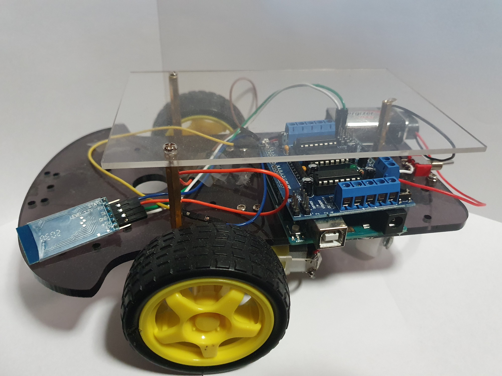

# Arduino Bluetooth RC Car
## Motivation

After taking a semester in Introduction to Computer Systems where I had to learn about how to use an arduino during my tutorials to work towards my project of building a maze finding arduino I was hooked into working with arduinos to create projects like an RC Car and more. This was the first thing I built after my semester ended and I was estatic when I got it to work.

## Getting Started

### Preprequisites

- [Arduino Software](https://www.arduino.cc/en/software)

#### Tutorial to follow
1. Follow tutorial to build on [youtube](https://www.youtube.com/watch?v=Q36NbjPMV5k)

I would like to claim that I am <b>not</b> the creator of the youtube video but I was inspired to build the RC Car after watching this video.

### Image of RC Car

### Footage of RC Car in Action

